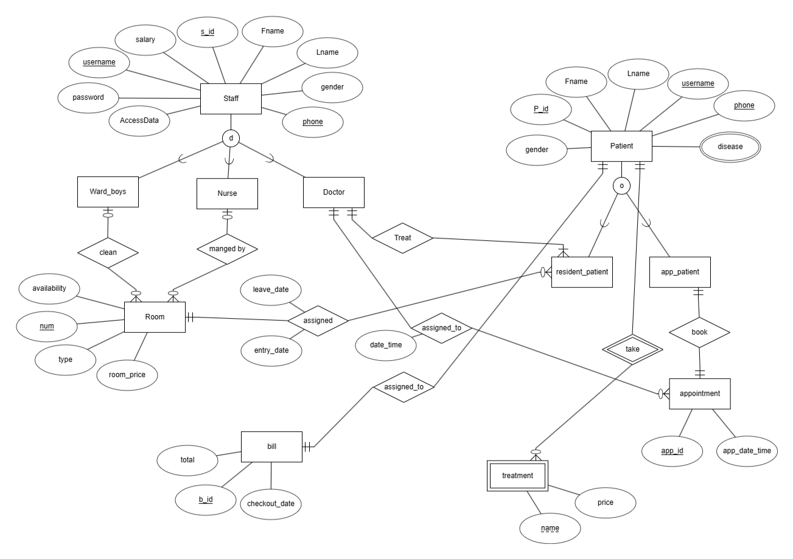
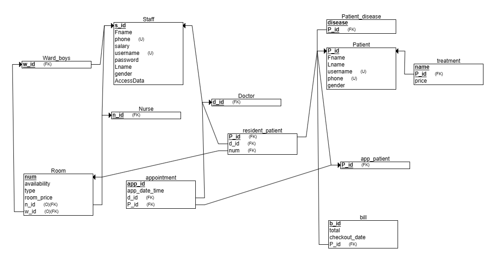

# Hospital Mangment System

## Overview

This project is a Hospital Mangment System built using PHP and MySQL. It allows Admin to create Bills for patients and doctors to know their patients and assigned rooms.

## Features

- **User Login::** log in as Admin/user(doctor).
- **Create Bills:** allow the admin to make checkout for patient (tratment prices + room based on type and days stayed)
- **Assigned Rooms:** allow the doctors to know their assigned patients and rooms. 

## Technologies Used

- **Backend:** PHP
- **Database:** MySQL
- **Frontend:** Bootstrap

## Contributors

Hospital Mangment System is made possible by the contributions of the following team members:

- Irinie Magued - Logical schema
- Menna Allah Saed - physical schema + php interface

## Database Design

### 1. **ERD**

### 2. **Schema**

